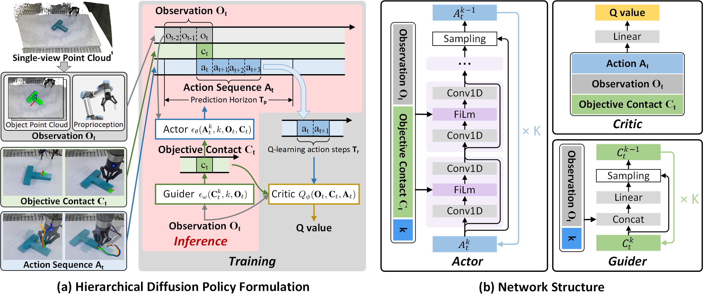
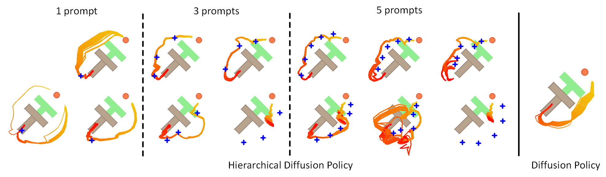

# Hierarchical Diffusion Policy

[[Paper]](https://arxiv.org/pdf/2411.12982)
[[Data]](https://drive.google.com/drive/folders/1dRdOB7WrvjQeSrbILsmdVBNb_4kizEj-?usp=drive_link)
[[Video]](https://youtu.be/ce1fg3p2MhI)





## 🛠️ Installation
### 🖥️ Simulation (Same as Diffusion Policy)
To reproduce our simulation benchmark results, install conda environment on a Linux machine with Nvidia GPU. On Ubuntu 20.04 you need to install the following apt packages for mujoco:
```console
$ sudo apt install -y libosmesa6-dev libgl1-mesa-glx libglfw3 patchelf
```

We recommend [Mambaforge](https://github.com/conda-forge/miniforge#mambaforge) instead of the standard anaconda distribution for faster installation: 
```console
$ mamba env create -f conda_environment.yaml
```

but you can use conda as well: 
```console
$ conda env create -f conda_environment.yaml
```

### 🦾 Real Robot
Data and code are being collated.


Software:
* Ubuntu 20.04.3 (tested)
* Mujoco dependencies: 
`sudo apt install libosmesa6-dev libgl1-mesa-glx libglfw3 patchelf`
* Conda environment `mamba env create -f conda_environment_real.yaml`


## 🖥️ Reproducing Simulation Benchmark Results 
### Download Training Data
Under the repo root, download `data.tar.xz` and decompress:
```console
[hierarchical_diffusion_policy]$ pip install gdown
[hierarchical_diffusion_policy]$ gdown https://drive.google.com/uc?id=1D9OkLOwDUjRjjRD6fKhF0p-tXz4KfXtW
[hierarchical_diffusion_policy]$ tar -xvJf data.tar.xz
```

### Running for a single seed
Activate conda environment and login to [wandb](https://wandb.ai) (if you haven't already).
```console
[hierarchical_diffusion_policy]$ conda activate robodiff
(robodiff)[hierarchical_diffusion_policy]$ wandb login
```

Launch training with seed 42 on GPU 0.
```console
(robodiff)[hierarchical_diffusion_policy]$ python train_hdp.py --config-dir=. --config-name=hdp_tilt.yaml training.seed=42 training.device=cuda:0 hydra.run.dir='data/outputs/${now:%Y.%m.%d}/${now:%H.%M.%S}_${name}_${logging.name}'
```

This will create a directory in format `data/outputs/yyyy.mm.dd/hh.mm.ss_<method_name>_<task_name>` where configs, logs and checkpoints are written to. Guider, Critic and Actor will be trained in sequence. Actor will be evaluated every 50 epochs with the success rate logged as `test/mean_score` on wandb, as well as videos for some rollouts.


### 🆕 Evaluate Pre-trained Checkpoints
Download checkpoints of Guider and Actor from the published checkpoint, such as [Actor ckpt](https://drive.google.com/file/d/1LRMO54b7JCsUq2kCHrpnI_wuK4-9ltXt/view?usp=drive_link) and [Guider ckpt](https://drive.google.com/file/d/1FFIN_irhI8z2l545eroZ9KVWO2VBB8PV/view?usp=drive_link).

Run the evaluation script:
```console
(robodiff)[hierarchical_diffusion_policy]$ python eval_hdp.py --config-dir=. --config-name=hdp_tilt.yaml guider_path='guider_ckpt_path' actor_path='actor_ckpt_path' training.device=cuda:0 hydra.run.dir='data/eval'
```

## Dataset

### Robomimic
Run the following code to augment the Robomimic dataset published by Diffusion Policy with object point clouds. The augmented dataset with object point clouds will be saved in the same directory. For example, running the code below will generate a new dataset named `low_dim_abs_pcd.hdf5` in the path `data/robomimic/datasets/square/mh/`.
```console
(robodiff)[hierarchical_diffusion_policy]$ python dataset/add_pcd_to_robomimic_dataset.py 'data/robomimic/datasets/square/mh/low_dim_abs.hdf5'
```
